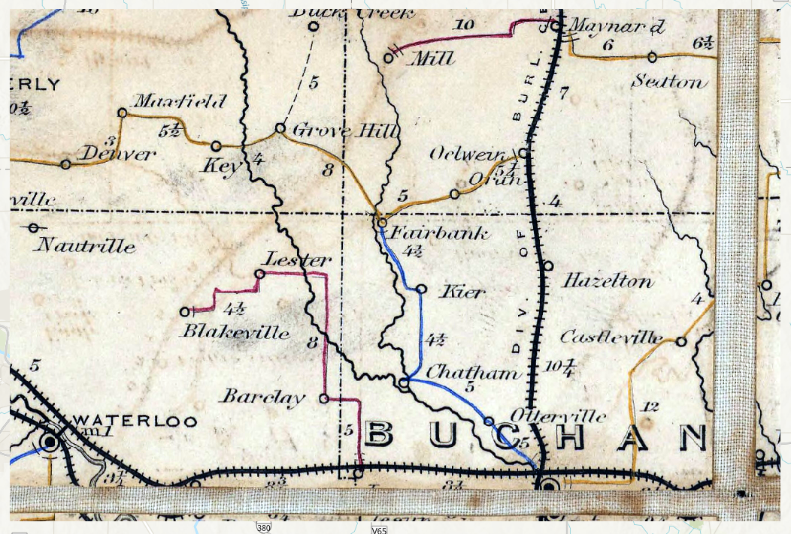

```{r, include = FALSE}
knitr::opts_chunk$set(
  collapse = TRUE,
  comment = "#>"
)
```

## Introduction

This short vignette is meant to demonstrate the utility of working with `arcpy` functions in the R environment. The following will be a series of processing functions applied to a raster file.

## Loading `arcpy`

In order to showcase some examples of arcpy functionality in R, we will first need to import the python. This is where we will need to use the `aRcGeo::init_arcpy()` function to import the module.

```{r setup}
library(aRcGeo)
```

```{r, eval=FALSE}
init_arcpy(conda_env = "arcgispro-py3-DeepLearning")
```

## Using ArcGIS Pro's Stretch and Segment functions

### Importing Original Raster

We can import our original raster by using a `file.path` function. In this case, the imported file is in a `.tif` format.

```{r, eval=FALSE}
Buchanan_Postal_Route_tif <- file.path(trim_path, "Postal_Routes_Selection.tif")
```

An RGB render of this image looks like the following:



### Stretched Raster

We would now like to use the stretch function in the `arcpy` module to process the image. The following code applies a Percentage Clipping stretch with a minimum percentage value of 0.05 and a maximum percentage value of 85. This will greatly reduce the background noise of the image.

```{r, eval=FALSE}
Stretched_Buchanan <- arcpy$ia$Stretch(Buchanan_Postal_Route_tif, 
                                       stretch_type ="PercentClip", 
                                       min_percent = 0.05, 
                                       max_percent = 85)
Stretched_Buchanan$save("Stretched Buchanan")
```

Our processed image now looks like the following:


### Segmented Raster

Once the stretched image process is complete, the raster will also go through a segmentation process which we can call in the following function.

```{r, eval=FALSE}
Segmented_Buchanan <- arcpy$sa$SegmentMeanShift(in_raster = Stretched_Buchanan, 
                          spectral_detail = 5,
                          spatial_detail = 15)
Segmented_Buchanan$save("Segmented Buchanan")
```

The applied segmentation function from the `arcpy` module has inputs of detail on a scale from 0-20. The following image is the output of a high spatial and low spectral segmented image.


## Discussion

As the examples demonstrate, `arcpy` functionality is possible in R using R
syntax to execute Python functions in R code chunks rather than having to call scripts. 
R is also able to recognize ESRI spatial objects, making conversions and 
compatibility with other R-spatial packages a possibility.
